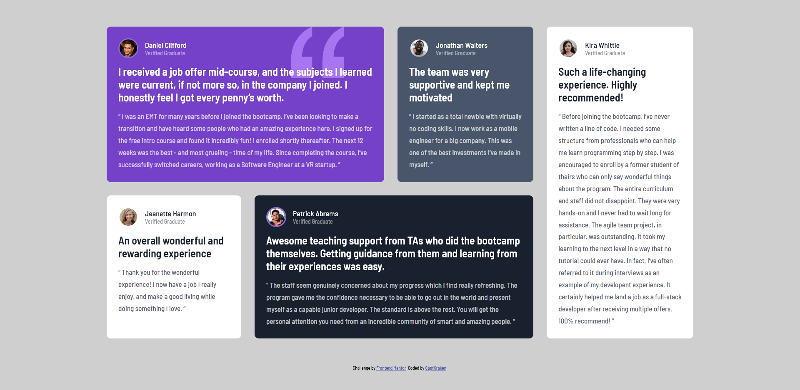

# Frontend Mentor - Testimonials grid section

## Welcome! 👋

Thanks for checking out this front-end coding challenge solution.

## Table of contents

- [Overview](#overview)
  - [The challenge](#the-challenge)
  - [Screenshot](#screenshot)
  - [Links](#links)
- [My process](#my-process)
  - [Built with](#built-with)
- [Author](#author)

## Overview

this challenge is also quite fun and since im trying to learn css grid, this is good for me.

### The challenge

Your challenge is to build out this testimonials grid section and get it looking as close to the design as possible.

You can use any tools you like to help you complete the challenge. So if you've got something you'd like to practice, feel free to give it a go.

Your users should be able to:

- View the optimal layout for the site depending on their device's screen size

### Screenshot

### Links

- Solution URL: [On Frontend Mentor](https://www.frontendmentor.io/solutions/profile-card-component-with-html-scss-css-flexbox-2qoUBBQ6v)
- Live Site URL: [Live Demo](https://captkraken.github.io/testimonial-grid-section)

## My process

Started out with HTML then went the mobile-first route. After that, started modifying things to fix the problems.

### Built with

- HTML5
- Sass
- Flexbox
- Grid

## Author

- Website - [My Github](https://github.com/CaptKraken)
- Frontend Mentor - [@CaptKraken](https://www.frontendmentor.io/profile/CaptKraken)
